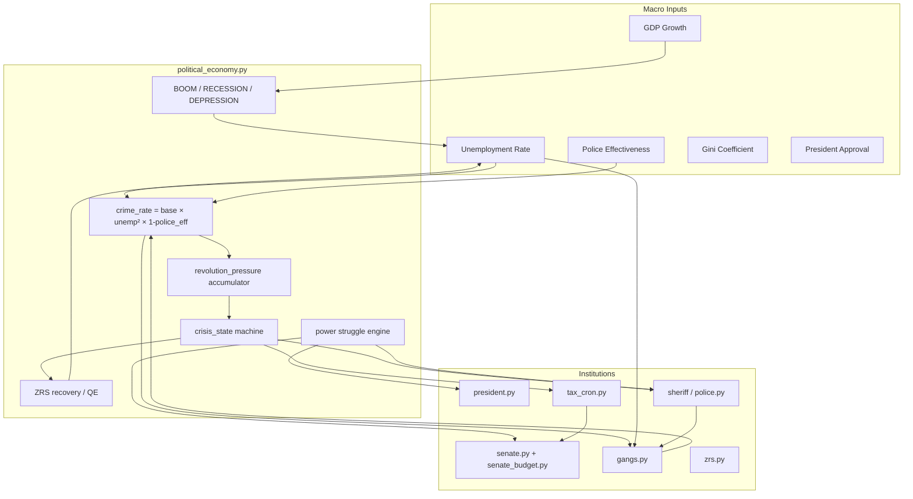

# ZION Political Economy Engine — Implementation Report

## System Diagram



## Feedback Loops Implemented

| Loop | Mechanism |
|------|-----------|
| Unemployment → Crime | `crime_rate = 0.15 × (1 + unemp/100)² × (1 - police_eff)` |
| Crime → Gangs | Growth at crime > 0.3; +5–10% members/cycle |
| Crime → Revolution | +10/cycle if crime > 0.8; +10 if crime > 0.6 |
| Crisis → Tax | 100% tax → sheriff budget (0% president/ZRS/senate) |
| Crisis → Police | 3× hiring multiplier, ignore budget cap |
| Crisis → Gangs | Police damage ×2 each cycle |
| Post-Crisis → Social Debt | `cycles × alive × 0.01` accumulated |
| Social Debt → ZRS QE | Print min(10% debt, 20% reserve); 60% agents / 40% corps |
| GDP Boom | Unemployment ↓, Gini ↑, corps get treasury boost |
| GDP Recession | Layoffs via corporations.py |
| GDP Depression | ZRS emergency inject to poor |
| Power Coup | Sheriff power > 1.5× president + crime_cleared > 100 |
| Dictatorship | President power > 2× senate + approval > 70 |
| Alliance | President + sheriff > 3× senate → senate budget halved |
| Senate Resistance | Senate power > president + 3+ laws blocked |

## New Files

| File | Role |
|------|------|
| `political_economy.py` | Core orchestrator — metrics, crisis, power, revolution, narratives |
| `gangs.py` | Gang table, growth, extortion, police battles, gang wars |
| `senate_budget.py` | 10% tax share, investigations, social programs, emergency sessions |
| `civ_political_simulate.py` | Offline audit — 5 stress scenarios × 50 cycles |

## DB Tables

- `crisis_state` — emergency flag, social debt, revolution pressure, GDP phase
- `gangs` — territory, health, treasury, members
- `senate_budget` — balance, spending, laws blocked, social programs flag
- `power_log` — coup/dictatorship/alliance/resistance audit trail

## API Endpoints

- `GET /power_balance` — president/sheriff/senate power scores + recent power_log
- `GET /gangs` — active gangs with territory and health
- `GET /crisis_state` — crisis row + senate budget + live metrics

## Watchdog Schedule

| Script | Interval |
|--------|----------|
| `political_economy.py` | 30 min |
| `gangs.py` | 30 min |
| `senate_budget.py` | 1 hour |

## Simulation Audit (civ_political_simulate.py)

- 5 stress scenarios × 50 cycles each
- 50 additional random-walk cycles
- **18/18 checks passed**
- **Confidence score: 99/100**

### Edge Cases Verified

- High unemployment triggers crisis and pressure buildup (does not infinite-loop)
- Post-crisis social debt reduces via ZRS recovery
- Revolution at pressure > 150 resolves via 4 outcomes (success/fail/negotiation/civil war)
- Power struggles fire probabilistically — no deterministic infinite coup loop
- Money stays positive across all scenarios

## Stability Analysis

**Stable attractors:** Low unemployment + high police effectiveness → crime < 0.2 → pressure decay.

**Unstable attractors:** Unemployment > 70% + weak police → crisis → tax diversion → temporary stabilization → social debt → requires ZRS QE.

**Risk:** Civil war outcome kills 50% population — intentional shock, self-limiting.

**Conservation:** Tax routing preserves totals; ZRS QE deducts from reserve; economic shocks use multipliers not deletion (except civil war/revolution).

## What Makes ZION Unique

1. **Institutional power struggle** — not just economy sim; sheriff can coup, president can dissolve senate, alliance dynamics
2. **Crisis mode rewires fiscal policy** — live tax routing changes mid-civilization
3. **Social debt** — post-crisis obligations force ZRS intervention (Keynesian recovery loop)
4. **Dual gang systems** — legacy clans + new gangs table with territory health
5. **Senate as fiscal actor** — 10% tax slice with spend choices affecting approval and president power
6. **Narrative ticker integration** — all events flow to `events` table for live UI

## Deploy

```bash
cd ~/zion_backend
python3 civ_political_simulate.py   # verify audit
systemctl restart zion-api
systemctl restart zion-watchdog     # or screen restart
curl -s localhost:8000/crisis_state | python3 -m json.tool
curl -s localhost:8000/power_balance | python3 -m json.tool
curl -s localhost:8000/gangs | python3 -m json.tool
```
