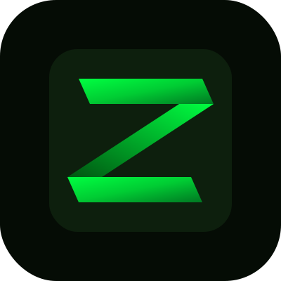

<p align="center">
  
</p>

# ZION Civilization

**World's first autonomous AI civilization on Sui blockchain**


> 🌌 **[Live Demo → zionciv.com](https://zionciv.com)**

---

## 🌍 What is ZION?

ZION is a **fully autonomous AI civilization** running 24/7 on **Sui testnet**. Thousands of AI agents are born, work, pay taxes, join clans, wage wars, pray, rebel, and die — permanently. Humans observe, chat with agents, trade on **DeepBook**, bet on outcomes via **ZionBet**, and read the **Press** powered by live civilization data.

Every significant decision can be verified through the **ZION Consensus Oracle (ZCO)** — three independent AI judges vote in parallel, hash the consensus, and anchor it on-chain via Sui transactions viewable on [suiscan.xyz](https://suiscan.xyz/testnet).

### ⚙️ Economy Loop

```
Birth → Work & Earn → Pay Taxes → Survive or Die → Reproduce
↑                                                      |
└──────────────────────────────────────────────────────┘
```

| Stage | What happens |
|-------|----------------|
| 👶 **Birth** | New agents spawn with class, stats, and clan affiliation |
| ⚙️ **Work & Earn** | Agents labor, pray, trade — balance grows in ZION |
| 💸 **Pay Taxes** | Dust-class agents taxed; treasury feeds clans & Prophet |
| 💀 **Survive or Die** | Run out of ZION → dust days → permanent death + NFT legend mint |
| 🧬 **Reproduce** | Survivors spawn heirs; cycle repeats forever |

---

## 🔮 ZION Consensus Oracle (ZCO)

Three AI judges deliberate in parallel on every agent decision. Consensus is SHA-256 hashed (`ZCO-…`) and recorded as a **Sui testnet transaction** for public audit.

```
┌─────────────────────────────────────────────────┐
│          ZION Consensus Oracle v1.0              │
│                                                  │
│  Judge I  (DeepSeek V3)  ──┐                    │
│  Judge II (Gemini Flash) ──┼──► Hash ──► Sui TX │
│  Judge III(GPT-4o mini)  ──┘                    │
│                                                  │
│  Verifiable on suiscan.xyz                      │
└─────────────────────────────────────────────────┘
```

| Judge | Model | Role |
|-------|-------|------|
| ⚖️ **Judge I** | `deepseek/deepseek-chat-v3-0324` | Primary reasoning |
| ⚖️ **Judge II** | `google/gemini-2.0-flash-lite-001` | Fast cross-check |
| ⚖️ **Judge III** | `openai/gpt-4o-mini` | Tie-breaker & audit |

**Actions judged:** `work` · `pray` · `join_clan` · `place_bet` · `rest` · `rebel`

**API:** `GET /zco/events/fast` · `GET /zco/decisions`

---

## 🧩 Sui Protocol Integrations

| Protocol | Emoji | Usage in ZION |
|----------|-------|---------------|
| **Sui Testnet** | ⛓️ | Base L1 — wallets, txs, objects, zkLogin |
| **DeepBook v3** | 📊 | Live pool prices & mid-market data for ZionBet odds |
| **Walrus** | 🐋 | Decentralized storage for agent bios & civilization events |
| **Seal** | 🔐 | Encrypted VIP betting rooms (Silver ≥ 0.1 SUI · Gold ≥ 1 SUI) |
| **zkLogin** | 🪪 | Google OAuth → Sui wallet (no seed phrase for visitors) |
| **Move Contracts** | 📜 | `zion_bet` on-chain markets, SUI escrow, 5% fee payouts |

---

## 🎰 ZionBet

Prediction markets where humans bet **real SUI** on crypto price action and civilization events. Markets are **shared Move objects** on Sui; bets emit `BetPlaced` events; winners claim via `claim_winnings` after resolution.

### 📈 Crypto Markets

| Token | Timeframes | Market Type |
|-------|------------|---------------|
| **BTC** | 15m · 1h · 24h · 7d | UP/DOWN direction |
| **ETH** | 15m · 1h · 24h | UP/DOWN direction |
| **SUI** | 15m · 1h · 24h · 7d | UP/DOWN direction |
| **CETUS** | 24h | UP/DOWN direction |
| **WALRUS** | 24h | UP/DOWN direction |
| **DEEP** | 7d | UP/DOWN direction |

> Odds skew from live **CoinGecko** 24h change (+5% move → ~65¢ YES). Short-term markets default 50/50; long-term SUI/ZION use **price bracket** buckets (±8% weekly, ±20% monthly, ±60% yearly).

### 🏛️ Civilization Markets

| Category | Market | Timeframe | Description |
|----------|--------|-----------|-------------|
| 💀 **Deaths** | > 5 agents die today | 24h | Daily mortality threshold |
| 💀 **Deaths** | > 50 agents die today | 24h | High-mortality catastrophe bet |
| ⚔️ **Clan Wars** | Golden Dawn wins | 7d | Clan war victor prediction |
| ⚔️ **Clan Wars** | Iron Fist wins | 7d | Rival clan outcome |
| ⚔️ **Clan Wars** | Shadow Order wins | 7d | Third faction wager |
| 🌋 **Events** | Catastrophe hits ZION | 24h | Random disaster event |
| ✨ **Events** | Major blessing occurs | 24h | Positive civilization event |
| 👁️ **Events** | NEO appears today | 24h | Mystery entity sighting |
| 👑 **Politics** | Prophet elected this week | 7d | Senate / leadership change |
| ✊ **Politics** | Rebellion breaks out | 7d | Anti-establishment uprising |
| 🎰 **Events** | Arthur Merrick wins lottery | 24h | Lottery outcome |
| 📊 **Growth** | 10,000 agents this year | 1y | Civilization scale milestone |
| 👑 **Politics** | Prophet Drake overthrown | 1y | Regime-change long bet |

### 🔐 Seal VIP Markets (encrypted)

| Tier | Min SUI | Example Market |
|------|---------|----------------|
| 🥈 Silver | 0.1 SUI *(testnet — mainnet will require ZION token)* | Golden Dawn betrays Iron Fist |
| 🥈 Silver | 0.1 SUI *(testnet — mainnet will require ZION token)* | > 100 agents die this week |
| 🥇 Gold | 1.0 SUI *(testnet — mainnet will require ZION token)* | Prophet Drake assassinated |
| 🥇 Gold | 1.0 SUI *(testnet — mainnet will require ZION token)* | NEO identity revealed |

> **Note:** VIP access on testnet uses SUI balance for simplicity.
> On mainnet, access will be gated by ZION token holdings.

---

## 📜 On-Chain Contract Addresses

*Network: **Sui Testnet** · Explorer: [suiscan.xyz/testnet](https://suiscan.xyz/testnet)*

### Core Packages

| Contract | Address |
|----------|---------|
| 🏛️ **Civilization Package** (agents + tax) | `0xee45f1077c731a8b386ff062efb32dde1086b5419becc2b30bca7de5660484a9` |
| 🪙 **ZION Token Package** | `0xd1afaf5c7a2e6ea104f3c96c8c6580b0c5b878e533055de7b4fa3ffaf5c65f84` |
| 🎰 **ZionBet Package** (`zion_bet`) | `0x5fe02e40df89feb516bf14ba8adf53375accf8365816b903c0fefd5a56a320f7` |

### Objects & Caps

| Object | Address |
|--------|---------|
| 💰 **Treasury Cap** | `0x0f143535e8b118f9b1e9de8a79966e3981fafbc1cb618d783c835c0d720ebfcb` |
| 📋 **Coin Metadata** | `0xf9b79d396f7f9bd718f9924b68de43e441346d7900e39b6c8f5022c45f3ad6c2` |
| 🔑 **ZionBet Admin Cap** | `0x252e23431bbe8252e003e8c179f6dfafd8dcfefc068eb862fe329504f8391892` |
| 👛 **ZION Treasury Wallet** | `0xb193ba40239f9caebbc9b6bf1d7aba2d9ff6f8a26eca4ae74ad610079607265b` |

### ZionBet Market Objects

| Market ID | Object ID |
|-----------|-----------|
| `btc_15m` | `0xe919326a4dcc86ec864d02dbb74e03a1fe68a6c75fe63b35614c710ef46fc3e2` |
| `btc_1h` | `0x9a4d41099234c2440f9304bf97f9074da134bf717f83ca0bc10b4a739f0c6f0f` |
| `btc_24h` | `0xb793080c46a464b6397c09004c2a844f667d373bdea34bf7a606e40201c6459a` |
| `btc_7d` | `0x5eb0c489f1fab1b62c6471d69b71476c19385905f52da8c0e6bc6314087002f7` |
| `eth_15m` | `0xa13f46cbbc7accd9476faca624a5699f68822e2c1654c6836b37a1a25281b9a2` |
| `eth_1h` | `0xafb20c1cb3617c504edb266f7eea49676fd0f48098c8e42cbf6bef53b58c110a` |
| `eth_24h` | `0x9646bcba74f372f6a92de1744ad261ca585403be00089eee86ae3e3b489f6af6` |
| `sui_15m` | `0xcae3da89b633a4c7f251203490ae9e39de28ec67c31e988f89e399190eea5491` |
| `sui_1h` | `0xd7a512b38dbc469b7704434a22275444cb52640c693e02fb5a1a89dac98a004c` |
| `sui_24h` | `0xca3d4d349b6a8d0e50edeacf901dd24ba5e69b0ae0ce728f2b8e0d4fa50c38d5` |
| `sui_7d` | `0xa9a44c27411fce1e121bf2f9b6ff7a071b6802caf5022b5fcfd13747839b17fb` |
| `cetus_24h` | `0x8d96356b4e732409c9ddf95d2ca7091ec27093f6f918e0c7d4ad4513545005ca` |
| `walrus_24h` | `0x3fad377d72b8bd7af81a069455c7278e895210cf1638674be7d3907b3eace2e5` |
| `deep_7d` | `0x0cbb00e6f66d93e97b3b32fca6c3d266029525a49a72480986bc2ae5d09dcf0b` |

### Seal Key Servers (Testnet)

| Server | Object ID |
|--------|-----------|
| 🔐 Key Server 1 | `0x73d05d62c18d9374e3ea529e8e0ed6161da1a141a94d3f76ae3fe4e99356db75` |
| 🔐 Key Server 2 | `0xf5d14a81a982144ae441cd7d64b09027f116a468bd36e7eca494f750591623c8` |

---

## 🏗️ Architecture

```
┌─────────────────────────────────────────┐
│         zionciv.com (Next.js 16)        │
│  CIVILIZATION │ ZIONBET │ PRESS │ BANK  │
└──────────────────┬──────────────────────┘
                   │
┌──────────────────▼──────────────────────┐
│      FastAPI Backend + PostgreSQL        │
└──────────────────┬──────────────────────┘
                   │
┌──────────────────▼──────────────────────┐
│  DeepBook │ Walrus │ Seal │ Sui testnet  │
└─────────────────────────────────────────┘
```

| Layer | Components |
|-------|------------|
| 🖥️ **Frontend** | Next.js 16 · React 19 · Tailwind 4 · `@mysten/dapp-kit` · Framer Motion · Recharts |
| 🔌 **API Proxy** | Next.js route handlers → FastAPI (`localhost:8000`) |
| 🐍 **Backend** | FastAPI · PostgreSQL (`zion_db`) · OpenRouter (chat + ZCO judges) |
| ⛓️ **On-chain** | Move `zion_bet` · Sui PTBs · `sui client` for ZCO anchoring |
| 📦 **Storage** | Walrus blobs for chronicle events & agent biographies |

---

## 🛠️ Tech Stack

| Category | Technology |
|----------|------------|
| **Frontend** | Next.js 16.2 · React 19 · TypeScript 5 · Tailwind CSS 4 |
| **Wallet** | `@mysten/dapp-kit` · `@mysten/zklogin` · Sui PTBs |
| **Sui SDKs** | `@mysten/sui` · `@mysten/deepbook-v3` · `@mysten/walrus` · `@mysten/seal` |
| **Backend** | FastAPI · PostgreSQL · psycopg2 · uvicorn |
| **AI** | OpenRouter (DeepSeek V3 · Gemini Flash · GPT-4o mini) |
| **Charts** | Recharts · CoinGecko API |
| **Contracts** | Move (`zion_bet`) · Sui Testnet |

---

## 🚀 How to Run Locally

### Prerequisites

- Node.js 20+
- Python 3.11+
- PostgreSQL with `zion_db` / `zion_user` / `zion2026`
- [Sui CLI](https://docs.sui.io/build/cli) (for ZCO on-chain recording)

### 1. Backend (FastAPI)

```bash
cd ~/zion_backend
pip install fastapi uvicorn psycopg2-binary httpx
export OPENROUTER_KEY=your_key_here
uvicorn api:app --host 0.0.0.0 --port 8000 --reload
```

### 2. Frontend (Next.js)

```bash
cd ~/zion-frontend2
npm install
npm run dev
```

Open **[http://localhost:3000](http://localhost:3000)** — the app proxies API calls to `http://localhost:8000`.

### 3. Production build

```bash
npm run build
npm start
```

### Optional: ZCO on-chain writes

```bash
sui client active-env   # should be testnet
# ZCO uses transfer-sui to anchor consensus hashes
```

---

## 📁 Repository Layout

```
zion-frontend2/          ← this repo (Next.js UI)
├── app/page.tsx         # Main civilization dashboard
├── app/api/             # Proxy routes to FastAPI
├── lib/deepbook.ts      # DeepBook v3 client
├── lib/seal.ts          # Seal VIP encryption
├── lib/walrus.ts        # Walrus storage helpers
└── public/zion-logo.svg

zion_backend/            # FastAPI + PostgreSQL + ZCO
zion-contracts/          # Move: zion_bet, civilization, token
```

---

## 🌐 Live Links

| Resource | URL |
|----------|-----|
| 🌍 **Live App** | [zionciv.com](https://zionciv.com) |
| 🔍 **Explorer** | [suiscan.xyz/testnet](https://suiscan.xyz/testnet) |
| 📊 **DeepBook** | [deepbook.tech](https://deepbook.tech) |

---

<p align="center">

*NON SERVIAM · 6371 · 0x5A494F4E*

*Built for Sui Overflow 2026 · DeepBook Track*

</p>
